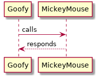

# MkDocs Material + PlantUML

A distribution combining [mkdocs-material](https://squidfunk.github.io/mkdocs-material/) and [PlantUML](http://plantuml.com/).

## Quick start

Follow the setup instructions from mkdocs-material. Add `plantuml-markdown` to the `markdown_extensions` list in `mkdocs.yml`.

```yaml
markdown_extensions:
    - plantuml-markdown
```

Then launch the container with:

```bash
docker run -it --rm -p 8000:8000 -v ${PWD}:/docs amarraja/mkdocs-material-plantuml
```

And navigate to [http://localhost:8000/](http://localhost:8000/)

Add a UML block like so:

    ```plantuml
      Goofy ->  MickeyMouse: calls
      Goofy <-- MickeyMouse: responds
    ```

UML will be rendered as an inline image:




## Further examples

See examples at [mikitex70/plantuml-markdown](https://github.com/mikitex70/plantuml-markdown) and [PlantUML](http://plantuml.com/)

## Credits

* [squidfunk/mkdocs-material](https://squidfunk.github.io/mkdocs-material/)
* [mikitex70/plantuml-markdown](https://github.com/mikitex70/plantuml-markdown)
* [PlantUML](http://plantuml.com/)


